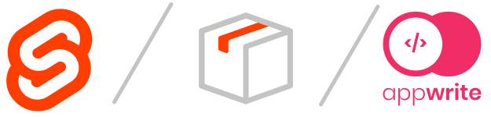

<p align="center">
  
</p>

# Support Us 

**Get free $100 credits on DigitalOcean:**

<a href="https://m.do.co/c/843c1f24ad90">
  
</a>

**Join our Discord:**

<a href="https://discord.gg/n3WZxtbkCm">
  
</a>

# SvelteKit Metawrite Starter Template

Everything you need to build a SvelteKit project powered with Appwrite backend, starter powered by [Increasio](https://increas.io/).

## Important to mention

We'll update this starter template once we fix issue with installing `metawrite` package using `npm install metawrite`. But with this template it's easy to get latest version of our `metawrite` package because we still use npm.

**Before developing install the `metawrite` package.**

```bash
npm run metawrite
```

### Keep in mind

- If you have to package your own lib source the you can rename existing `package` folder or use another output directory for `svelte-kit package`.
- Also, if you're not using Docker or any CI/CD, custom workflows for deployment, then consider removing `package` folder from `.gitignore` file and run `npm run metawrite` before commiting or deployment.

## Developing

Once you've installed Metawrite with `npm run metawrite` and installed other dependencies with `npm install` (or `pnpm` or `yarn`), start a development server:

```bash
npm run dev

# or start the server and open the app in a new browser tab
npm run dev -- --open
```

## Building

To create a production version of your app:

```bash
npm run build
```

You can preview the production build with `npm run preview`.

## Building with Docker

If you need build command:

```bash
docker-compose up --build
```

This is a good option for deployment, because starter template has all required configs to automatically install newest version of `metawrite`, all dependencies and start SSR server using Node.

# Appwrite and SvelteKit Combo

You can add this template to your Appwrite Server configuration by pasting following on top of your Appwrite's `docker-compose.yml` services:

```yml
services:
  frontend:
    image: koodeau/sveltekit-metawrite
    container_name: frontend
    restart: unless-stopped
    env_file: .env
    environment:
      VITE_SITE_URL: ${VITE_SITE_URL}
      VITE_ENDPOINT_URL: ${VITE_ENDPOINT_URL}
      VITE_PROJECT_ID: ${VITE_PROJECT_ID}
      VITE_LOCALE: ${VITE_LOCALE}
    #   Add more env variables here
    volumes:
      - ./app:/srv/frontend
    ports:
      - "3000:3000"
```

And add following to your Appwrite's `.env` file:

```
VITE_SITE_URL=localhost
VITE_ENDPOINT_URL=http://localhost/v1
VITE_PROJECT_ID=example
VITE_LOCALE=en
```

> Don't forget to change values to match your server configuration.

> To deploy your app if you're not using Docker, you may need to install another [adapter](https://kit.svelte.dev/docs/adapters) for your target environment.
